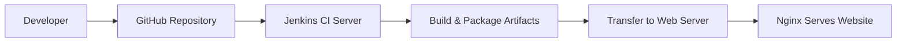
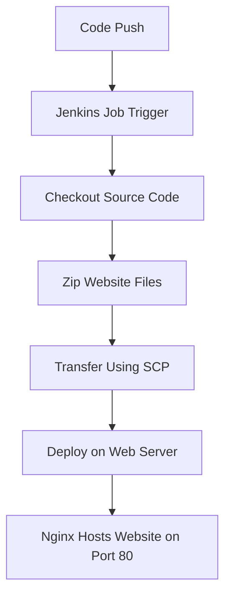
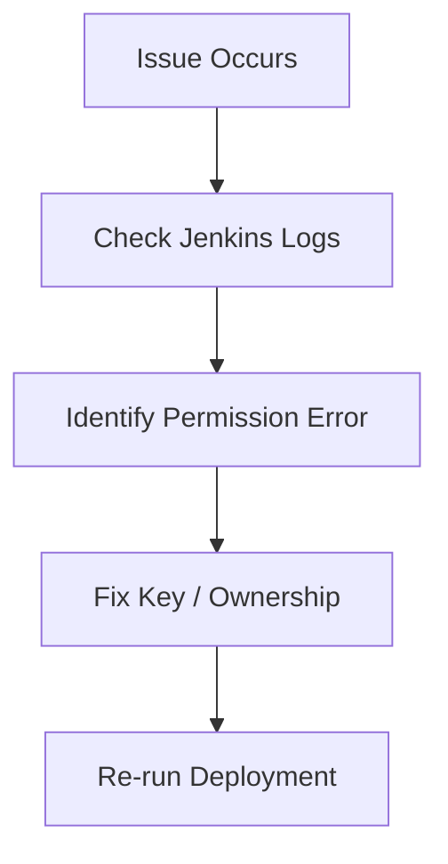
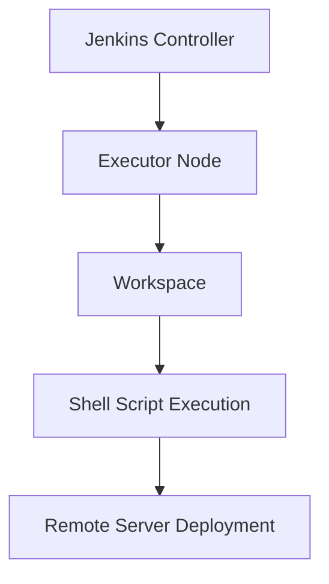

# 🚀 Jenkins-Static-Website-CICD

> **Author:** Sudarshan Bhosale  
> **Role:** Cloud & DevOps Engineer (Fresher – Hands-on Project)  
> **Environment:** AWS EC2 (Ubuntu), Jenkins, GitHub, Nginx, Linux  

---

## 📌 Project Overview

In this project, I implemented a **complete Jenkins CI/CD pipeline** to deploy a **static website** on an AWS Web Server using **Nginx**.  
The pipeline automates the workflow from **code commit → build → artifact transfer → deployment → hosting on port 80**.

This project simulates **real-world DevOps practices**, including automation, security handling, troubleshooting Jenkins pipeline errors, SSH permissions, and multi-server deployment.

---

## 🧠 My Real Hands-On Responsibilities

I personally performed:

- Setup of **Jenkins CI/CD Server (EC2 Ubuntu)**
- Setup of **Web Hosting Server (EC2 Ubuntu)**
- Integrated **GitHub with Jenkins (SCM)**
- Created **Jenkins Freestyle Job**
- Developed **Linux Shell Automation Scripts**
- Implemented **Secure SCP & SSH Connectivity**
- Installed & Configured **Nginx Web Server**
- Opened HTTP Port 80 for users
- Debugged real Jenkins issues like:  
  ✔ zip not installed  
  ✔ SSH permission denied  
  ✔ PEM key access errors

This project helped me understand **how Jenkins executes CI/CD pipelines and production deployment workflows**.

---

## 🧩 Technologies & Tools Used

| Technology | Purpose |
|------------|--------|
| Jenkins    | CI/CD Automation |
| GitHub     | Source Code Repository |
| AWS EC2    | Cloud Infrastructure |
| Ubuntu     | Server OS |
| Nginx      | Web Hosting |
| SSH / SCP  | Secure Communication |
| HTML       | Static Website |

---

---

## 🧩 Technologies & Tools Used :-

| Technology | Purpose |
|----------|--------|
| Jenkins | CI/CD Automation |
| GitHub | Source Code Management |
| Nginx | Web Server |
| Ubuntu | Server OS |
| SSH / SCP | Secure Communication |
| HTML | Static Website |
| AWS EC2 | Cloud Infrastructure |

---
## 🏗️ Architecture Diagram :-
```
+-------------+        +---------------------+        +----------------------+
| Developer   | -----> | GitHub Repository   | -----> | Jenkins Server       |
| (Local PC)  |  Push  | (Source Code SCM)   |  Pull  | (CI/CD Automation)   |
+-------------+        +---------------------+        +----------+-----------+
                                                                      |
                                                                      | SCP / SSH
                                                                      v
                                                           +----------------------+
                                                           | Web Server           |
                                                           | (Nginx)              |
                                                           | Static Website Host  |
                                                           | Port 80 (HTTP)       |
                                                           +----------+-----------+
                                                                      |
                                                                      v
                                                           +----------------------+
                                                           | Users                |
                                                           | Access via Browser   |
                                                           +----------------------+

```

---

## 🏗️ High-Level Architecture Diagram



---

## 🔄 CI/CD Workflow




---

## 🖥️ Infrastructure

1️⃣ Jenkins Server

- Ubuntu EC2

- Jenkins Installed

- Pulls Code

- Packages Files

- Transfers & Deploys

2️⃣ Web Server

- Ubuntu EC2

- Nginx Installed

- Port 80 Enabled

---

## 📂 Project Repository Structure


```text
My-Web-Deploy/
│
├── index.html
├── home.html
├── README.md
├── Sudarshan_Jenkins_CICD_Project.pdf
```

🚀 Deployment Location

```text
/var/www/html
```

---

## 🔐 Security & Networking

| Type | Protocol | Port | Source |
|-----|----------|------|--------|
| HTTP | TCP | 80 | 0.0.0.0/0 |
| SSH | TCP | 22 | Jenkins Server |

---

## ⚙️ Jenkins Configuration

- **Job Type:** Freestyle  
- **Source Code Management:** Git  
- **Repository URL:**
```
https://github.com/<your-username>/jenkins-static-website-cicd.git
```

✔ **Port 80 open** → Public Website  
✔ **Port 22 restricted** → Secure Deployment


---

## ⚙️ Jenkins Shell Script

```bash
sudo apt update
```
```
sudo apt install zip -y
```
```
zip mysite.zip ./*.html
```
```
sudo chmod 600 /home/ubuntu/<your-key>.pem
```
```
sudo scp -i /home/ubuntu/<your-key>.pem -o StrictHostKeyChecking=no mysite.zip ubuntu@<WEB_SERVER_IP>:.
```
```
sudo ssh -i /home/ubuntu/<your-key>.pem -o StrictHostKeyChecking=no ubuntu@<WEB_SERVER_IP> << EOF
```
```
sudo apt update
```
```
sudo apt install nginx zip -y
```
```
sudo cp mysite.zip /var/www/html
```
```
cd /var/www/html
```
```
sudo rm -f *.html
```
```
sudo unzip mysite.zip
```
```
curl http://localhost
```
```
EOF
```

---

## ❌ SSH / SCP Permission & Issue Handling



---

## 🧠 Jenkins Internal Working



---

## 🧪 Validation

### 🌐 Access your website
```
http://<WEB_SERVER_PUBLIC_IP>
```
✔ Loads Successfully  
✔ Hosted via Nginx  
✔ Running on Port 80


---

## 🌟 Why This Project Is Important

- Shows real **DevOps CI/CD automation**
- Demonstrates **AWS + Jenkins + Linux**
- Displays **secure multi-server deployment**
- Strong **portfolio project for DevOps Fresher**

---

  ## 🚀 Future Enhancements

- Convert Freestyle Job to **Jenkinsfile (Declarative Pipeline)**
- Add **GitHub Webhooks**
- Dockerize **Nginx Deployment**
- Enable **HTTPS / SSL**
- Add **Monitoring & Logging**

---

  ## 👨‍💻 About Me

**Sudarshan Bhosale**  
Cloud & DevOps Engineer (Fresher)  
Learning **CI/CD | Cloud | Automation | DevOps Tools**

---

## 🌐 Connect With Me

- 🔗 [LinkedIn](https://www.linkedin.com/in/sudarshan-bhosale-174477374)
- 🔗 [GitHub](https://github.com/Sudarshan-Bhosale145)

  
  ⭐ **If you liked this project, don’t forget to star the repository!**
